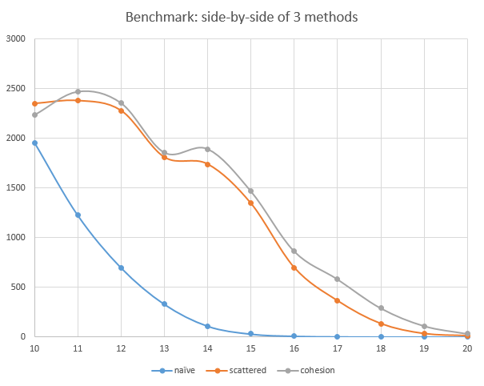
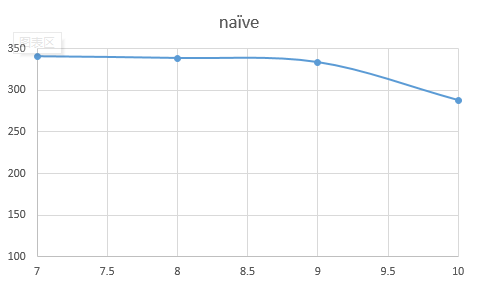
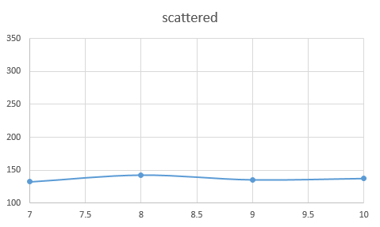
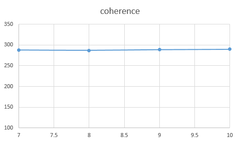

**University of Pennsylvania, CIS 565: GPU Programming and Architecture,
Project 1 - Flocking**

* Name: Bowen Yang
  * [LinkedIn](https://www.linkedin.com/in/%E5%8D%9A%E6%96%87-%E6%9D%A8-83bba6148)
  * [GitHub](https://github.com/Grillnov)
  * [Facebook](https://www.facebook.com/yang.bowen.7399)
  * [Steam](https://steamcommunity.com/id/grillnov)
* Tested on: Windows 10 x64, i7-6800K @ 3.40GHz 32GB, GTX 1080 8GB (Yep I've got another personal computer at home)

* Additional modification made to the repo
  Modified the option in ./src/CMakeLists.txt and make it "sm_60" instead again.

* **What we achieved**
Flocks of flocks of playful boids. The number shown at the top-left corner is the framerate by NVIDIA's shadowplay.
  
  
* **Analysis: boids**
A side-by-side comparison of the performance of these 3 methods. The y axis represents the framerate (frames per second) and the x axis is the log of the number of total particles. (i.e. x = 10 means that there're 1024 boids in total) Technically it's a log plot.
The block size is 128 for all test cases.
  
  
  * For the naive implementation we can clearly see that the framerate drops quadratically with respect to the log of the number of boids. It's fairly easy to explain this behavior: Our naive implementation is a 2-layered nested loop for all boids and thus has a time complexity of O(n^2).
  * For the scattered uniform grid implementation the performance is significantly boosted compared to the naive one, since we are no longer looping over every boid for every boid. Instead, we loop only over those that're considered within the proximity of the current boid.
  * For the coherent implementation, the trends are the same as the scattered uniform grid, and it outperforms the scattered grid implementation since we no-longer have the "middleman" in the way. But at lower number of boids we can see that sometimes the implementation without the "middleman" runs faster. This can be explained since the coherent implementation creates more overhead when it comes to re-shuffling, the performance boost is eaten up by the additional calculation introduced.
  * The anomaly happening around n = 2^13 to 2^14 for these 2 uniform grid implementation methods: The complexity of the uniform grid is not deterministic and still has an upper bound of O(n^2), therefore when the distribution becomes dense, the computational cost won't necessiarly increase proportionally.
  
* **Analysis continued: blocks**
 * Naive implementation: tested at 8192 particles. The y axis represents the framerate (frames per second) and the x axis is the log of the block size. (i.e. x = 10 means that block size is set to 1024). The performance drastically dropped when block size reaches 1024 (maximum).
 
 
 
 * Scattered implementation: tested at 262144 particles. The performance is relatively not sensitive to the block size, but dropping with block size increasing as well.
 
 
 
 * Coherent implementation: tested at 262144 particles. The performance is relatively not sensitive to the block size, but dropping with block size increasing as well.
 
 

 * Explanation: For the naive implementation, the performance drop when block size reached 1024 is probably caused by the spatial locality: When block size is small enough and each stream multiprocessor only loops the 2-layered loop for a relatively small amount of boids, the global memory patch accessed by each stream multiprocessor is smaller. Therefore the locality is better when the block size is set smaller.
* Feedback
The pseudo-code is somewhat misleading when it comes to averaging mass-center or perceived velocity.
